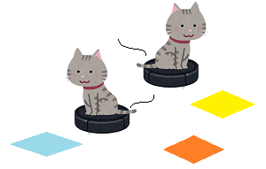

# Summer Intern 2019
本インターンは、クロスパワーアプリ部門インターン2019「検索サイトを作ってみよう」です。

## 目的
**●　クローリング・スクレイピングができるようになる**  

検索サイトを作るんじゃないの？という方はご安心を。  
この二つは検索サイトのキーとなる技術なのです。   
また、この二つは検索サイトの作成に役立つだけでなく、  
個人的な情報収集にも多いに役立つことも知られています。    
この研修を通じて、参加者が圧倒的情報強者への第一歩を踏み出していただけることを期待しています。  

←弊社イメージ

**●　Pythonが使えるようになる**  
Pythonを既に使えるという方は多いのではないはないでしょうか。  
というのも、現在プログラミング言語のシェアは非常に高いからです。
事実、Youtube, Instagram, Dropboxなど有名なアプリケーションがPythonを採用しています。
これは、記述や実行が簡単というスクリプト言語の利点以上の旨味を皆感じているためといえるでしょう。  
是非その旨味を今回のインターン含め、様々なアプリケーションを作る過程で感じていただきたいと思います。
***
## 検索サイトについて
**「検索サイトの裏では無数のロボットが走っている。」** と言ったら信じますか？  

有名な検索サイトとして、GoogleやYahoo、Bingなどが挙げられますが  
これらどのサイトの裏でもクローラと呼ばれるロボットが日々駆け回っています。  
（残念ながら在り物のロボットが跳んだり跳ねたりしているわけではないのですが…）  
今回はこのクローラと呼ばれる謎のロボット?を知り、参加者にはこのロボットが作れるようになってもらいます。

それでは改めまして今回のテーマ、検索の仕組みをざっくりと説明しますと、  
　　「クローラがサイトを巡回してページ情報を分解、インデックスに登録しています。」  
.....？？
  
順番に見ていきましょう  
まずは予備知識として「クローラ」を簡単に説明します。  

「クローラ」とは  

複数のURLを与えられ、それらのURLからページの中でほしい情報を抽出して回るロボットです  
(クローリングしてくれるロボットで別名"スパイダー")

※特に検索サイトのクローラはあるドメインについてまずはrobots.txtというファイルを参照します。  
　これには、サイト内のマップと進入禁止場所が書かれており、許可された場所のみクローリングする仕様になっています。  

　

これを踏まえて、改めて検索の仕組みを説明しましょう。  
１．ドメインを基にページのrobots.txtを開く。サイトマップなどを取得。  
２．各ページを巡回して、文章などを単語レベルで切り分けてインデックスに保存する。  
３．併せてその他、サイトの新しさなどのシグナルも保存する。  

これだけです。（3番にGoogleの検索順位などが関わっており、一般的にSEOと呼ばれています。）  
＜参考＞  
[SEO（Search Engine Optimization:検索エンジン最適化）](https://moukegaku.com/google-ranking-algorithm/#domain)  

以上のようにクローラが必死に駆け回ってくれているから、我々は検索することができるんですね～。
  

***
## スクレイピングについて
  スクレイピングとは「ページのhtmlから情報を収集・抽出すること」です。  

スクレイピングとクローリングの違いはなんでしょうか？  
クローリングには収集・抽出に加えて、様々なサイトを回るという意味合いが入ってきます。  
※Crawlは英語で、はう/腹ばっていく/こそこそ歩き回る、という意味合いを持ちます。

つまり、スクレイピングが広義に情報を収集・抽出する行為全般を指すのに対し、  
クローリングはより具体的に様々なサイトを回りながら情報収集していく行為を意味するのです。

***

## 環境準備手順
環境準備は以下の手順に則って行うこと。
1. [アプリインターンリポジトリ](https://github.com/crosspower/app_intern)
にて「clone or download」ボタンを押下し、URLをコピー
2. 「git clone [**URL**]」をVSCode上で実行し、ファイルを一括で取得  
    (app_internディレクトリに移動)
3. 「py -m venv venv」で"venv"という名前で仮想環境を作成する
4. 「. intern/Scripts/activate」で仮想環境に入る
5. 「pip install -r requirements.txt」でモジュールを一括インストール
6. frontendディレクトリに移動し、「npm install」でモジュールを一括インストール
7. 「npm run serve」でフロントエンドのサーバーを起動
8. 「uvicorn main:app --reload」でバックエンドのサーバーを起動
9. ブラウザ上で[http://localhost:8080/](http://localhost:8080/)にアクセスし、動作を確認する  

以上、準備完了
